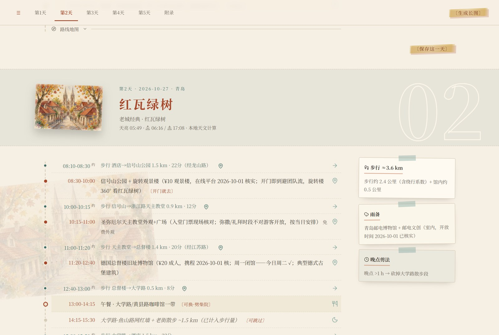
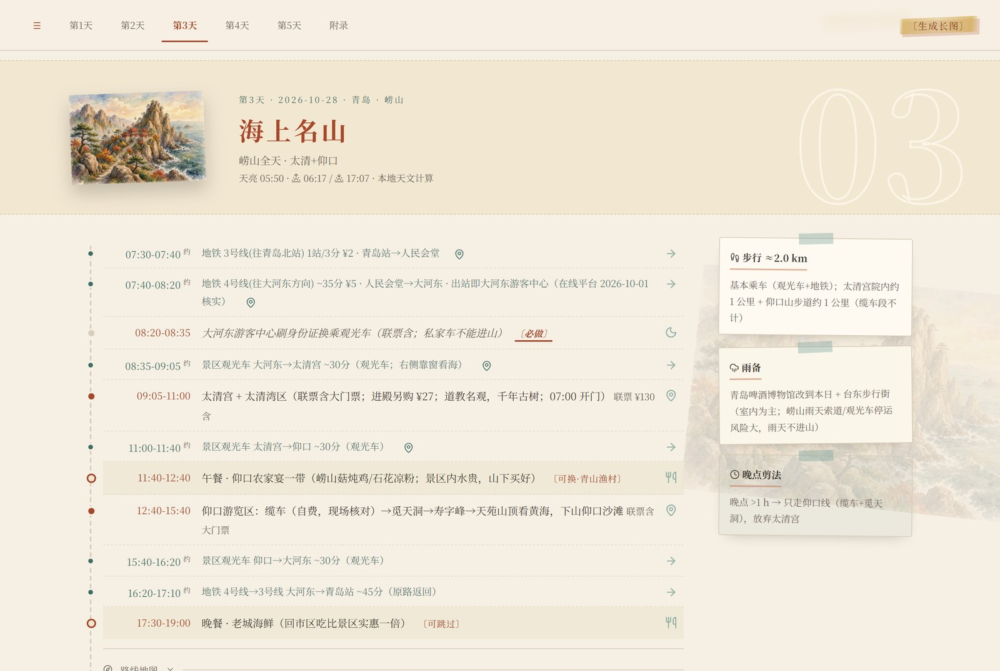
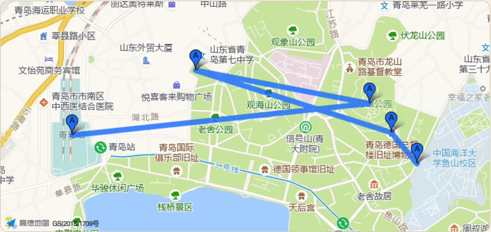
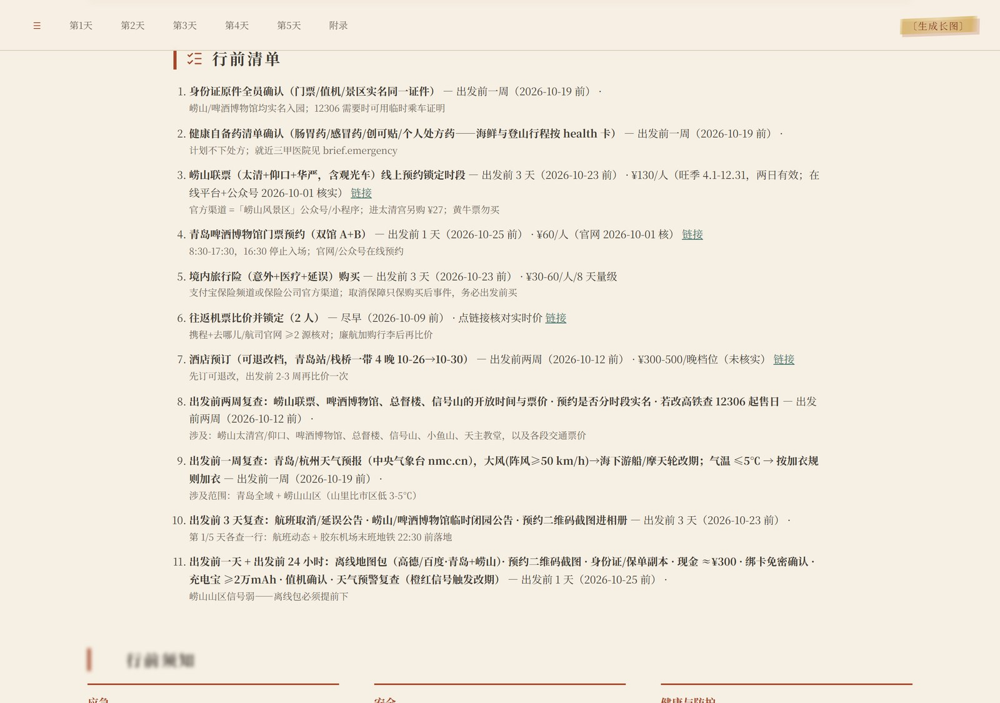
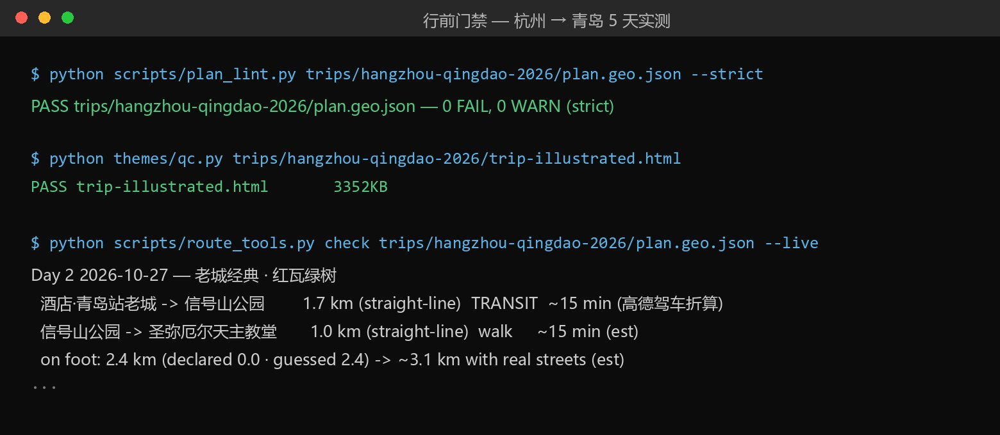

# Trip Planner Skill（境内优化版）


一个开放格式的 Agent Skill：跑在你正在使用的编码智能体（Claude Code、Codex、Gemini CLI、Cursor 等，任何能加载 Agent Skills 的宿主）里。你给一句旅行需求，它产出一份逐小时、信息核实过、可以直接照着订的行程计划，最终交付为一个自包含的设计版 HTML 页面。地图、交通、节假日、支付等链路均针对中国境内旅行场景做了深度适配。

它只做规划：查营业时间、排行程、给深链、列清单；不代订、不付款、不填个人信息。

适配范围与改造记录见 [ADAPTATION.md](ADAPTATION.md)。

## 成品示例：杭州 → 青岛，5 天 4 晚

[`examples/hangzhou-qingdao-2026/`](examples/README.md) 是用本 skill 完整跑通的一趟真实规划（2026-10-26 至 10-30，双飞往返，老城单基地，含崂山全天与啤酒博物馆线路），同一份计划渲染了**全部七种主题**的成品页，另附离线 KML、行前清单日历和五天全部插画。

**成品页封面**（水彩风格，为本次行程定制绘制，页面完全自包含、双击即开）：


**每一天是独立的一屏**：时间轴逐小时排列，右侧给出步行量、雨备和晚点剪法三类现场贴士：





**每一天可展开高德路线地图**——静态地图直接烙进页面，离线可看，不泄漏任何密钥：



**行前清单**按截止日期排序，预约、购票、查证任务各自带深链与核对日期，并可导出为 `.ics` 日历：



**交付前全部通过内容门禁**。以下为本仓库实际运行 `plan_lint`（内容门禁）、`qc`（页面静态质检）与 `check --live`（高德实时时距核对）的输出：



[`examples/china-2026/`](examples/) 与 [`examples/chongqing-2026/`](examples/)、[`examples/shanghai-2026/`](examples/) 另收三个示例：沪京西 8 天多城（黏土/闪屏双主题），以及分别为主题示例定制的重庆 4 天（闪屏版 × 山城霓虹夜景）与上海周末 3 天（杂志版 × 梧桐区漫步）——说明主题与行程气质的搭配思路，详见 [`examples/README.md`](examples/README.md)。

## 功能特性

- **跨城交通深链**：`scripts/flight_scan.py` 把日期网格翻译成携程 / Trip.com / 去哪儿机票与携程火车票的直达链接。国内没有免密钥的票价接口，脚本不做任何网络请求，价格由你点开链接核对。
- **逐小时每日计划**：营业时间、闭馆日、预约政策（分时实名预约类景区）全部用工具核实后写入，每一跳都有高德/百度地图链接。
- **高德静态路线图**：每天的路线图以静态图片形式内嵌页面，离线可用，密钥不出现在成品文件里。
- **`plan.geo.json` 单一事实源**：主题页面、地图链接、离线 KML、日历文件全部由这一份 JSON 生成。
- **住宿与预算**：按片区给出酒店候选（带日期深链，不编造房价）、人民币预算汇总、按截止日排序的预订清单。
- **行前简报**：应急号码、气象预警、假日调休、支付分层、离线地图准备等，全部境内数据源。
- **图片三级策略（素材库优先）**：先用内置素材库选图；素材库没有合适图片且模型自身能生图，才为行程定制绘制；再不行用环境变量里的境内生图 key（阿里云百炼 / 硅基流动）。页面在任何一档下都完整交付。
- **交付纯度**：自检与修复在后台静默完成；正文不出现内部代号、生硬措辞或能力说明，只有你真正关心的行程内容。

## 工作原理

`SKILL.md` 是智能体照着执行的剧本，分六个阶段：意图收集 → 行前简报 → 路线骨架 → 城际交通 → 每日计划与酒店 → 汇总自检与渲染交付。与你最多交互三次（通常两次）：补问缺失信息、从 2–3 套路线骨架里挑一套、最终交付。

七条硬规则贯穿全程：绝不代订付款；价格与营业时间来自工具而非记忆；先免密钥后浏览器、绝不抓取 OTA 页面；搜索预算显式受限；估算一律标注；超过约 3 个月的营业时间必须二次核实；交付前必过对抗式自检；目的地以中国大陆为主要场景（细则见 [ADAPTATION.md](ADAPTATION.md)）。

## 快速开始

### 1. 安装

把本目录放进你所用宿主的 skills 目录（Claude Code 为 `~/.claude/skills/trip-planner-cn`）。运行环境只需 Python 3.9+ 标准库；可选安装 Pillow 用于素材流水线（`pip install pillow`）。

### 2. 三十秒验证

不需要任何密钥，在本目录执行：

```bash
python themes/render_clay2.py examples/china-2026/china.geo.json -o china-clay.html
python themes/qc.py china-clay.html    # 退出码 0 即通过
```

### 3. 规划一趟旅行

在智能体里用自然语言提需求即可，旅行类请求会自动触发本 skill：

```
云南 8 天，10 月出发，中等预算，自然风光和古城，日期前后可挪 2 天
```

智能体会按问法选择四种工作模式之一：

| 模式 | 触发示例 | 执行内容 |
|---|---|---|
| 整趟旅行 | 帮我规划云南 8 天 | 全部六个阶段 |
| 单日规划 | 我们在杭州有一天 | 节假日检查 + 单日计划 + 自检 |
| 空档填充 | 我在 X 附近有 2 小时空 | 15 分钟半径内 2–3 个选项 |
| 临场重排 | 高铁没赶上 / 下暴雨了 | 只重建受影响的那一天 |

### 4. 渲染成品页

计划定稿后，用 Phase 0 选定的主题渲染（默认插画版）：

```bash
python themes/render_theme2.py plan.geo.json --art plan.art.json -o trip-illustrated.html
python themes/qc.py trip-illustrated.html
```

七种主题任选：`theme2`（插画）、`clay2`（黏土）、`noir2`（黑白）、`glass2`（玻璃）、`journal`（手记）、`zine`（杂志）、`splash`（闪屏）。`themes/render_picker.py` 可生成一页风格选择页，链接某趟行程的全部已渲染版本。

## 配置说明

所有密钥均为可选；不配置任何密钥也能完成规划与渲染，只是相应能力降级。

| 环境变量 | 作用 | 缺失时的行为 |
|---|---|---|
| `AMAP_KEY` | 高德 Web 服务 key：坐标解析（`geocode`）、实时时距（`check --live`）、周边 POI（`poi`）、每日静态路线图 | 静态地图在页面中隐藏，坐标手工填写，时距用估算值；`geocode`/`poi` 不可用 |
| `BAIDU_MAP_AK` | 百度地理编码回退 | 跳过回退 |
| `DASHSCOPE_API_KEY` / `SILICONFLOW_API_KEY` | 境内生图（阿里云百炼通义万相 / 硅基流动 Kolors），`themes/gen.py --provider auto` 自动检测 | 图片走原生能力或素材库 |
| `TRIP_MAP_PROVIDER` | 深链服务商，`amap`（默认）或 `baidu`，均为免密钥 | 用默认高德 |

**申请高德 key**：在高德开放平台（lbs.amap.com）注册并实名认证后创建应用，key 类型选「Web 服务」，个人开发者免费额度充足。拿到 key 后任选其一：

- 在 skill 根目录建一个 `.env` 文件（可参照 `.env.example`）写入 `AMAP_KEY=你的key`，脚本会自动读取；
- 或写入系统环境变量。`.env` 已被 `.gitignore` 排除，不会进入版本库。

## 命令行工具

`scripts/route_tools.py` 统一处理计划文件（用法均为 `python scripts/route_tools.py <子命令> <plan.json> [参数]`）：

| 子命令 | 功能 |
|---|---|
| `geocode` | 高德/百度解析 stop 坐标并写回（缓存于 `geocache.json`） |
| `check` | 逐跳直线距离与时长核对；`--live` 用高德驾车/公交实时时距替换估算值 |
| `links --write` | 为每一跳生成并回写高德/百度深链，拒绝可疑行并输出汇总 |
| `kml` | 导出 Organic Maps 可用的离线 KML |
| `sun` | 本地 NOAA 天文模型计算每日日出日落与民用晨光（零网络） |
| `ics` | 从预订清单生成带提醒的日历文件 |
| `poi` | 高德周边 POI 搜索（关键词、半径、条数可调），结果坐标可直接贴回计划 |

其他脚本：

```bash
python scripts/flight_scan.py --from 杭州 --to 青岛 --depart 2026-10-26 --nights 4   # 城际交通深链网格
python scripts/plan_lint.py plan.geo.json --strict    # 渲染前内容门禁，退出码即 FAIL 条数
python themes/qc.py trip-illustrated.html             # 页面静态质检：离线契约、无 JS 降级、链接卫生
```

## 仓库结构

```
SKILL.md                      剧本：六个阶段、硬规则、四种模式（目的地核对在 Phase 0）
ADAPTATION.md                 境内适配记录：受限资源清单、替换对照、改造日志
references/                   十一份阶段细则（数据源、排程、导航、输出模板、各阶段判据等）
scripts/
  flight_scan.py              机票/火车票深链生成器（免密钥、零网络）
  route_tools.py              geocode · check · links · kml · sun · ics · poi
  plan_lint.py                渲染前内容门禁
  render_plan.py              朴素可打印 HTML（备用，非默认交付物）
themes/
  render_theme2.py 等         七个主题渲染器 + 风格选择页
  theme_common.py             共享工具、多语言、离线分享图引擎、高德静态地图
  qc.py                       页面静态质检
  gen.py                      境内生图（百炼 / 硅基流动）
  stock_art.py                素材库选图，拼装 art.json
  towebp.py cutout.py 等      素材流水线
  ART-SCHEMA.md               art.json 契约
  assets/                     图库与素材库（stock kit）
assets/plan.example.json      计划文件 schema 模板
examples/
  README.md                   示例介绍：七种主题版本对照、渲染命令、已知限制
  hangzhou-qingdao-2026/      杭州 → 青岛 5 天实战（七种主题成品页 + 插画 + KML + ICS）
  chongqing-2026/             重庆 4 天（splash 闪屏版主题示例：山城霓虹）
  shanghai-2026/              上海周末 3 天（zine 杂志版主题示例：梧桐区漫步）
  china-2026/                 沪京西 8 天多城示例（两种主题成品页）
docs/screenshots/             README 配图
.env.example                  环境变量模板（.env 本体不入库）
```

## 数据来源

境内直连、免密钥优先；页面中的深链是价格与票务的真源，脚本输出用于交叉核对。明细与回落链见 [references/data-sources.md](references/data-sources.md)。

| 数据源 | 用途 |
|---|---|
| 高德 restapi（`AMAP_KEY`，免费） | 坐标解析、实时时距、周边 POI、静态路线图 |
| 百度地理编码（`BAIDU_MAP_AK`） | 坐标解析回退 |
| 高德/百度网页深链 | 每一跳导航（免密钥） |
| 12306 / 携程 / 去哪儿 / Trip.com | 机票与火车票深链 |
| timor.tech + 国务院放假安排 | 法定节假日与调休 |
| Open-Meteo | 对应日期天气 |
| 中央气象台 nmc.cn / 12379 | 气象预警（橙红色预警为行程停止线） |
| 本地 NOAA 天文模型 | 日出日落（零网络） |

## 限制与非目标

- 为境内行程深度优化：地图导航、火车票、节假日调休、应急信息等链路开箱即用；境外目的地未做适配，如需使用请自行核实数据源。
- 仅图文交付，不含任何视频能力。
- 不追踪延误、不改签；价格会变，每个数字都带核对日期。
- 不代订、不付款、不填写个人信息。

## 致谢

- [Caveat](https://fonts.google.com/specimen/Caveat)（SIL OFL 1.1）与 [Lucide](https://lucide.dev/)（ISC），许可证全文见 [THIRD-PARTY-NOTICES.md](THIRD-PARTY-NOTICES.md)。
- 高德开放平台、百度地图开放平台、Open-Meteo、timor.tech。
- 图片生成：阿里云百炼通义万相、硅基流动 Kolors。

## 许可证

MIT，见 [LICENSE](LICENSE)。
